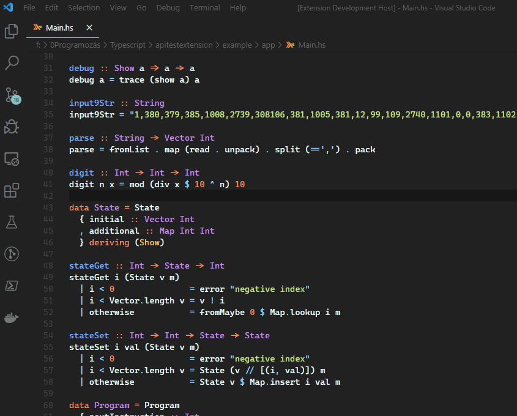

# haskell-profile-highlight README

Color highlighting for Haskell profiling information.



## Testing the extension

After cloning the repo, open the project in VS Code.

Press `F5` to start a debug build.

## Usage

Open a Haskell source file that you have profiling information about. Be sure to have the profiling information in JSON.

An example for generating the profiling info:
``` 
stack build --profile
stack exec --profile -- <your program> +RTS -pj -fprof-auto <more profiling options> 
```

With the file open press `Ctrl+Shift+P` to open up the available commands and run `Haskell Profile Highlight: Toggle highlight`. You will have to input the full path of the profile file.

Running this command toggles the highlight on and off.

If you want to change the path of the profile file, run the command `Haskell Profile Highlight: Change profile path`